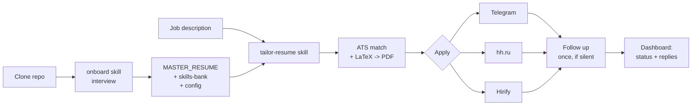

# JobHunter

**Your job search, run as a pipeline — inside Claude Code.**

Clone it, open it in Claude Code, and it interviews you: who you are, what roles
you want, what you are actually good at. From that it builds your master resume,
then for every vacancy it tailors a resume + cover to the job description and
helps you apply through the channels you already use — Telegram job chats, hh.ru,
Hirify — at a human pace, with you reviewing every send.

No hardcoded anything. Your data, your keys, your browser, your call.

---

## What it does

- **Onboards you by conversation.** An onboarding skill interviews you and writes
  your `MASTER_RESUME`, your skills-bank, and your config. No forms to guess at.
- **Tailors per vacancy, honestly.** An ATS matcher surfaces the skills that are
  *both* in your bank *and* in the job description, injects them into a clean
  LaTeX resume, and compiles a PDF. It never invents skills to game a filter.
- **Applies through your channels.** Rate-limited helper scripts drive Telegram,
  hh.ru, and Hirify through a browser you launched and logged into. Dry-run by
  default — nothing sends until you say so.
- **Follows up, once.** Nudges silent threads after N days and skips anyone who
  already replied.
- **Tracks by name.** One slug per vacancy ties the resume file, the output
  folder, and any reply back to the exact application. Filename == identity.

## The pipeline



## 60-second quickstart

```bash
git clone <your-fork-url> && cd JobHunter_by_Egor_Nikolaev
npm install

# Try the resume tailoring on the bundled sample vacancy:
node resume/tailor.js acme-pm en examples/sample_jd.txt "Product Manager (AI)"
# -> output/acme-pm/cv.pdf   (needs `tectonic` for the PDF step)
```

Then open the folder in **Claude Code** and say **"onboard me"**. It builds your
real profile and walks you to your first tailored application. Full steps:
[`docs/SETUP.md`](docs/SETUP.md).

## Which MCPs to connect first

1. **A browser-automation MCP** (Playwright/Chrome) — highest value; lets Claude
   read vacancies and operate the channels through a browser you control.
2. **This repo's filesystem** — Claude reads your resume/bank and writes output.

Details, and what to avoid, in [`docs/MCPS.md`](docs/MCPS.md).

## Repo layout

```
config/     config.example.json, skills-bank.example.json   (copy -> your own)
profile/    MASTER_RESUME.example.md                         (fake persona template)
resume/     tailor.js, ats_match.js, templates/cv_en.tex, cv_ru.tex
engine/     channels/{telegram,hh,hirify}.js, followup.js, forms.js, proxy/, browser-setup.md
dashboard/  index.html    (self-contained pipeline view, mock data)
docs/       SETUP.md, MCPS.md, SAFETY.md
.claude/    settings.json, skills/{onboard, tailor-resume}
```

## Screenshots

<!-- TODO: drop screenshots here -->
- `docs/img/onboarding.png` — the onboarding interview in Claude Code
- `docs/img/tailored-cv.png` — a tailored resume PDF
- `docs/img/dashboard.png` — the pipeline dashboard (`dashboard/index.html`)

## Safety, rate limits & disclaimer

JobHunter is an automation aid. **You are responsible for complying with each
platform's Terms of Service.** Automated messaging and applications can lead to
account limits or bans. Always review generated messages before sending them. Be
respectful of recruiters' time. Rate limits exist for a reason. This project does
not help you spam anyone or bypass any platform's protections.

Defaults are conservative: `autoSend: false` (dry-run), 25 sends/day, 90s apart.
Read [`docs/SAFETY.md`](docs/SAFETY.md) before you flip anything on.

## License

[MIT](LICENSE) © 2026 Egor Nikolaev.

## Author

Built by **Egor Nikolaev**.
Portfolio: https://egor-nikolaev.base44.app
LinkedIn: https://www.linkedin.com/in/george-nikolaev

Contributions welcome. Keep the repo free of real secrets and personal data —
ship placeholders only.
